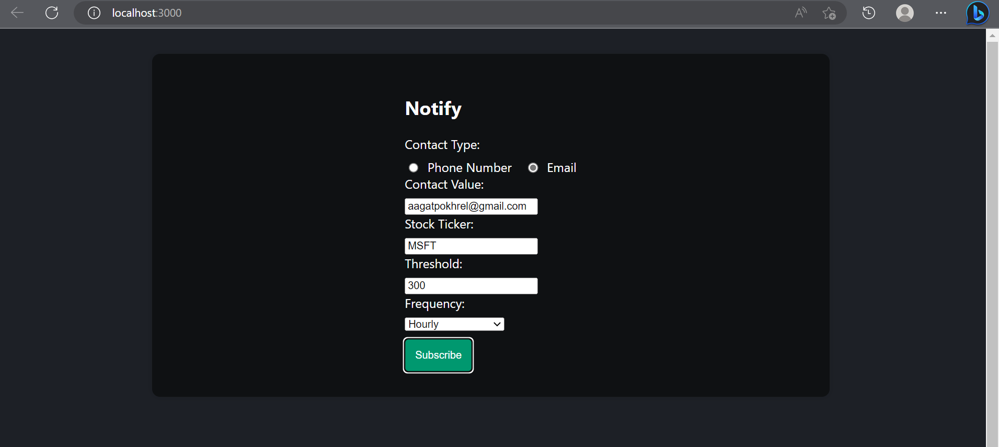
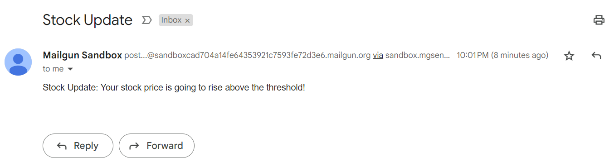

# Stockify

Notification application, that periodically informs about specific stocks from yahoo finance.


## Installation

Install my-project with npm and pip

Prerequisites

- Go to twilio (for sms) and create an account and setup a phone number and sid and token.
- Then create a `.env` file in backend folder and put the sensitive information there
- Go to mailgun for setup (for mail) and get the mail key. put this in `.env` as well.

For frontend
```bash
  cd frontend
  npm install
  npm run
```

For backend
 ```bash
  cd backend
  pip install -r requirements.txt
  python main.py
```   


## API Reference

#### Test the backend

```http
  GET /
```

#### Subscribe

```http
  POST /subscribe
```

| Parameter | Type     | Description                       |
| :-------- | :------- | :-------------------------------- |
| `contactType`      | `string` | **Required**. ContactType of subscriber |
| `contactValue` | `string` | **Required**. Value of contact of subscriber |
| `stockTicker` |	`string` |	**Required**. Stock Ticker to subscribe to
| `threshold` |	`float` |	**Required**. Price threshold to be notified
| `frequency` |	`string` |	**Required**. Frequency of notifications

#### GetStock

```http
  GET /getstock
```
The response will be a JSON object with the following fields:

| Field Name | Type     | Description                       |
| :-------- | :------- | :-------------------------------- |
| `companyName` |	`string` |	Name of the company |
| `address` |	`string` |	Address of the company |
| `industry` |	`string` |	Industry of the company |
| `currentPrice` | 	`float`	| Current stock price of the subscribed ticker |


## Screenshots




